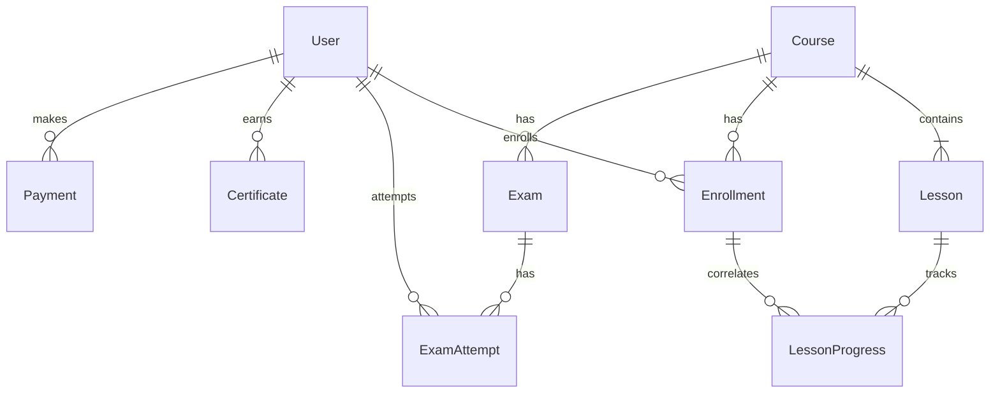

# Implementation Plan — Nexus Orbit Academy

We will build a premium, full-stack online learning platform called **Nexus Orbit Academy**. It features a galaxy/space-themed design (dark cosmic mode, glassmorphism, nebula gradients, and interactive animations) and implements course locking logic, timed examinations, certificate verification, payment gateways, and an AI chat tutor.

---

## 1. Project Initialization & Stack Configuration

To establish a solid, scalable structure, we will use **Next.js (App Router)** with **Tailwind CSS**. 

### Config & Branding
We will create a centralized branding file to allow changing the logo or academy details globally:
* `src/config/branding.js` configures the logo path (`/logo.png`) and academy details.

### Database Setup (Prisma + SQLite/Postgres)
We will use **Prisma ORM**. By default, it will be configured with a local **SQLite** file to allow instant, zero-configuration local runs. The schema will be written to be fully compatible with **PostgreSQL** (the provider can be switched to `postgresql` in `schema.prisma` and connected to Supabase/PostgreSQL via the `DATABASE_URL` env variable).

---

## 2. Database Schema Design

The tables will cover all required entities:



### Schema Models
1. **User**: `id`, `name`, `email`, `passwordHash`, `role` (STUDENT, ADMIN), `createdAt`.
2. **Course**: `id`, `title`, `description`, `department` (AEROSPACE, AI_ML, SPACE_TECH, UNIVERSE), `level` (BEGINNER, INTERMEDIATE, ADVANCED), `price` (free or paid amount), `syllabus` (JSON structure or chapters), `createdAt`.
3. **Lesson**: `id`, `courseId`, `chapterTitle`, `title`, `order`, `videoUrl` (Bunny Stream ID), `notes` (Markdown text), `quiz` (JSON questions), `createdAt`.
4. **Enrollment**: `id`, `userId`, `courseId`, `enrolledAt`.
5. **LessonProgress**: `id`, `enrollmentId`, `lessonId`, `completed` (boolean), `watchPercent`, `quizPassed` (boolean), `updatedAt`.
6. **Exam**: `id`, `courseId`, `type` (ENTRANCE, FINAL), `timeLimit` (minutes), `passingScore` (percent), `questions` (JSON list of MCQs and numerical questions).
7. **ExamAttempt**: `id`, `userId`, `examId`, `score`, `passed` (boolean), `answers` (JSON), `attemptedAt`.
8. **Certificate**: `id`, `userId`, `courseId`, `certificateId` (unique string), `issuedAt`, `qrCodeUrl`.
9. **Payment**: `id`, `userId`, `courseId`, `razorpayOrderId`, `razorpayPaymentId`, `amount`, `status` (PENDING, SUCCESS, FAILED), `createdAt`.

---

## 3. Core Features & Implementation Details

### A. Dark Space Theme (Vanilla CSS + Tailwind)
* **Backgrounds**: Deep space black-blue (`#060814` to `#0d1117`) with blurred gradient blobs representing nebulas (indigo, violet, cyan, purple).
* **Star Twinkling**: A lightweight CSS canvas background or keyframe-animated particles.
* **Component Styling**: Glassmorphic cards (`backdrop-blur-md bg-white/5 border border-white/10`).
* **Branding Coding**:
  * Aerospace Engineering: blue/cyan glow (`shadow-[0_0_15px_rgba(0,217,255,0.3)]`)
  * AI & Machine Learning: purple/magenta glow (`shadow-[0_0_15px_rgba(123,47,247,0.3)]`)
  * Space Tech: orange/amber glow (`shadow-[0_0_15px_rgba(255,184,0,0.3)]`)
  * Universe Department: deep violet glow (`shadow-[0_0_15px_rgba(150,50,250,0.3)]`)

### B. Custom JWT-Based Authentication
* Since Next.js App Router runs in a Node/Edge environment, we will use a custom cookie-based JWT authentication (`jose` + `bcryptjs`) for user validation.
* Middleware (`src/middleware.js`) protects `/dashboard` and `/admin` routes.
* Roles: `STUDENT` and `ADMIN`.

### C. Sequential Lesson Unlock Logic
* **Backend Enforced**: Before serving notes, videos, or quiz contents for a lesson, the backend API will check if:
  1. The user is enrolled in the course.
  2. The course is Beginner level, OR the student has passed the entrance exam.
  3. If it is lesson `N` (where `N > 1`), check if lesson `N-1` is marked as completed.
* **Completion Definition**: Video watch percentage $\ge 90\%$ (tracked by regular heartbeat requests from the player) AND the lesson quiz (if present) is passed.

### D. timed Exam Engine (IIT Pattern)
* timed examinations (e.g. 15-30 minutes for tests, custom duration).
* MCQs with options, positive/negative marks (e.g., +4 for correct, -1 for incorrect), and numerical entry questions.
* Focus detection: listening to window `blur` and `focus` events. If the student switches tabs more than 3 times, the exam auto-submits.
* Auto-grading: computed instantly on submit.

### E. AI Chat Tutor
* side panel or floatable chat bubble on `/dashboard/course/[id]`.
* Contextual prompt construction: injects the current lesson transcript/notes as system instructions.
* Hindi / Simple Language toggle.
* Rate limit: Free users get 5 messages/day; paid users have unlimited access (or high limit).
* Uses Claude API client (or Google Gemini API client as a reliable alternative, or a mock response if keys are not present).

### F. Video Player & Bunny.net Stream
* Expiring token generation for Bunny.net Stream or custom secure uploads.
* Disable right-click, prevent default browser controls, hide standard video sources.
* Visual watermark showing "Logged in as: User Name (Email)" floating subtly across the screen.

### G. Certificate Builder
* HTML Canvas-based image/PDF generator.
* Includes academy logo, student name, course name, date of completion, signature, unique verification ID, and a verification QR code.
* QR code links back to the public `/verify/[id]` page, which fetches and validates the certificate against the database.

### H. Payments Integration (Razorpay)
* Full client-server flow: Client requests order -> Server creates Razorpay order -> Client opens Razorpay popup -> Server verifies signature.
* **Sandbox Toggle**: If Razorpay API keys are not present in `.env`, the checkout displays a gorgeous "Sandbox Mode / Test Payment" interface that mocks a successful transaction, allowing full testing of the enrollment flow.

---

## 4. Proposed File Changes

We will create a standard Next.js directory structure inside `src/`.

### [Component: Next.js Boilerplate]
#### [NEW] [branding.js](file:///c:/Users/gulsh/OneDrive/Desktop/Nexus-Orbit-Academy/src/config/branding.js)
Configuration file exporting `LOGO_PATH` and project constants.
#### [NEW] [middleware.js](file:///c:/Users/gulsh/OneDrive/Desktop/Nexus-Orbit-Academy/src/middleware.js)
Auth middleware validating JWT cookies for `/dashboard` and `/admin` routes.

### [Component: Database]
#### [NEW] [schema.prisma](file:///c:/Users/gulsh/OneDrive/Desktop/Nexus-Orbit-Academy/prisma/schema.prisma)
Database schema with SQLite connector and models.
#### [NEW] [seed.js](file:///c:/Users/gulsh/OneDrive/Desktop/Nexus-Orbit-Academy/prisma/seed.js)
Seed script populating courses, lessons, quizzes, and exams for all four departments.
#### [NEW] [db.js](file:///c:/Users/gulsh/OneDrive/Desktop/Nexus-Orbit-Academy/src/lib/db.js)
Prisma client initializer.

### [Component: Auth & Helpers]
#### [NEW] [auth.js](file:///c:/Users/gulsh/OneDrive/Desktop/Nexus-Orbit-Academy/src/lib/auth.js)
Password hashing (bcryptjs) and JWT utilities (jose).

### [Component: Public Pages]
#### [NEW] [page.js](file:///c:/Users/gulsh/OneDrive/Desktop/Nexus-Orbit-Academy/src/app/page.js)
Twinkling background, interactive space widgets, department hover blocks, and student testimonials.
#### [NEW] [layout.js](file:///c:/Users/gulsh/OneDrive/Desktop/Nexus-Orbit-Academy/src/app/layout.js)
Global layout containing font settings (Orbitron / Inter), nav header, and footer.
#### [NEW] [globals.css](file:///c:/Users/gulsh/OneDrive/Desktop/Nexus-Orbit-Academy/src/app/globals.css)
Star animation styles, custom nebula gradients, custom scrollbars, and keyframes.

### [Component: Dashboard & Classroom Pages]
#### [NEW] [dashboard/page.js](file:///c:/Users/gulsh/OneDrive/Desktop/Nexus-Orbit-Academy/src/app/dashboard/page.js)
Student dashboard rendering enrolled courses, progress bars, and course catalog tab.
#### [NEW] [dashboard/course/[id]/page.js](file:///c:/Users/gulsh/OneDrive/Desktop/Nexus-Orbit-Academy/src/app/dashboard/course/[id]/page.js)
Course player interface containing:
- Sidebar with sequential unlock indicator (with tooltips and locks).
- Subtitle/notes tab.
- Sub-90% video progress blocker + custom video player (anti-piracy, watermark, watch listener).
- Lesson Quiz form.
- Contextual AI Chat Tutor widget.
#### [NEW] [dashboard/exam/[id]/page.js](file:///c:/Users/gulsh/OneDrive/Desktop/Nexus-Orbit-Academy/src/app/dashboard/exam/[id]/page.js)
IIT MCQ / Numerical timed exam panel with tab focus detection, timers, and automatic results display.
#### [NEW] [dashboard/certificates/page.js](file:///c:/Users/gulsh/OneDrive/Desktop/Nexus-Orbit-Academy/src/app/dashboard/certificates/page.js)
List of earned certificates with visual rendering and print/download actions.
#### [NEW] [verify/[id]/page.js](file:///c:/Users/gulsh/OneDrive/Desktop/Nexus-Orbit-Academy/src/app/verify/[id]/page.js)
Public verification page displaying valid certificate metadata on lookup.

### [Component: Admin Panel Pages]
#### [NEW] [admin/page.js](file:///c:/Users/gulsh/OneDrive/Desktop/Nexus-Orbit-Academy/src/app/admin/page.js)
Admin metrics, list of students, list of courses, and database action shortcuts (re-seed, reset).
#### [NEW] [admin/courses/page.js](file:///c:/Users/gulsh/OneDrive/Desktop/Nexus-Orbit-Academy/src/app/admin/courses/page.js)
Interactive course and lesson builder: add chapters, lessons, questions, and edit text.

### [Component: APIs]
We will implement Next.js API Routes (`/api/auth/*`, `/api/courses/*`, `/api/enroll/*`, `/api/progress/*`, `/api/exam/*`, `/api/payment/*`, `/api/chat/*`) to process all requests securely on the backend.

---

## 5. Verification Plan

### Automated Checks
* **Build Verification**: Compile Next.js build:
  ```bash
  npm run build
  ```
* **Linting Check**: Run Next.js linter:
  ```bash
  npx next lint
  ```

### Manual Verification
1. **Registration & Auth**: Create a student account and an admin account. Verify access tokens and dashboard redirects.
2. **Payment Mock**: Enroll in an Intermediate/Advanced course. Test checkout using Sandbox Mode.
3. **Entrance Exam**: Verify you cannot view lessons until the entrance exam is passed. Take the exam, test tab-switch auto-submit.
4. **Lesson Unlock**: Open Lesson 1. Watch video to 90% (or speed up for testing) and pass the quiz. Check that Lesson 2 unlocks on screen and in database.
5. **AI Chat Tutor**: Send a prompt. Verify responses are contextually relevant to the selected lesson (and test simple/Hindi toggles).
6. **Certificate Generation**: Pass the final exam, view and download the generated certificate, and verify the verification URL works.
